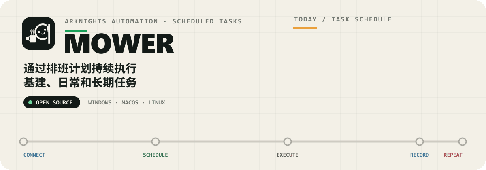
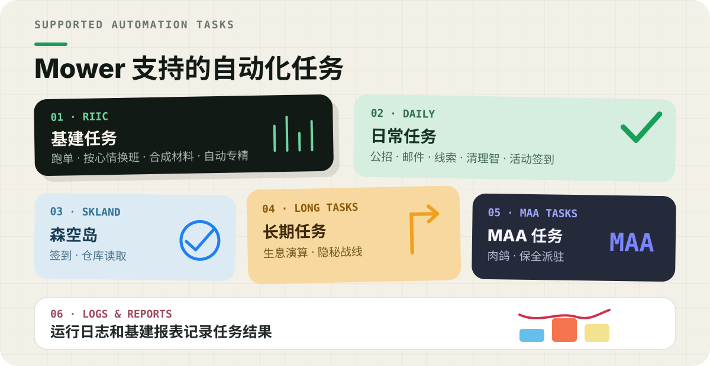
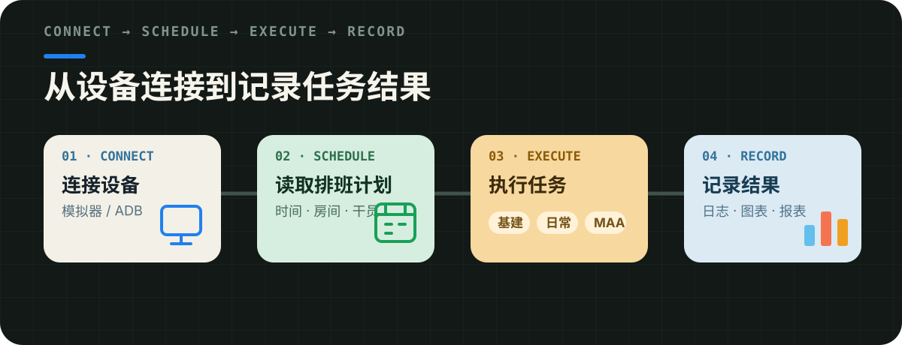

<p align="center">
  
</p>

<p align="center">
  <a href="https://arkmowers.github.io/arknights-mower/manual/"><strong>入门指南</strong></a>
  ·
  <a href="https://arkmowers.github.io/arknights-mower/manual/install/"><strong>下载与更新</strong></a>
  ·
  <a href="#源码构建"><strong>源码运行、测试与打包</strong></a>
  ·
  <a href="#docker-部署"><strong>Docker 部署</strong></a>
</p>

Mower 是一款面向长期运行的开源《明日方舟》自动化工具，支持 Windows、macOS 和 Linux。Mower 通过 ADB 连接游戏环境，按照排班计划执行基建换班、日常任务和长期任务，并将执行过程与结果写入日志和报表。

<a id="真实界面"></a>

<p align="center">
  
</p>

<p align="center">
  
</p>

排班编辑器用于配置房间、干员和触发条件。运行日志记录任务执行过程，基建报表整理长期运行产生的数据。以下图片来自项目界面。

<p align="center">
  <a href="./img/plan-editor.png">排班编辑器截图</a>
  ·
  <a href="./img/log.png">运行日志截图</a>
  ·
  <a href="./img/settings.png">设置界面截图</a>
  ·
  <a href="./img/riic-report.png">基建报表截图</a>
</p>

<a id="能力地图"></a>

<p align="center">
  
</p>

<p align="center">
  
</p>

- **基建任务**：跑单、根据干员心情换班、自动合成材料、自动专精；
- **日常任务**：公招、邮件、线索、清理智和活动签到；
- **森空岛任务**：签到和仓库读取；
- **长期任务**：生息演算、隐秘战线；
- **MAA 任务**：调用 MAA 执行肉鸽和保全派驻；
- **运行记录**：运行日志、基建报表和数据图表。

<a id="运行机制"></a>

<p align="center">
  
</p>

<p align="center">
  
</p>

Mower 与设备保持连接，读取排班计划中的执行时间和任务配置，再调用基建、日常、MAA 等模块执行任务。执行过程与结果会写入运行日志和报表。

<a id="开始使用"></a>

<p align="center">
  
</p>

| 使用场景 | 文档入口 |
| --- | --- |
| 第一次安装并运行 Mower | [Mower 入门指南](https://arkmowers.github.io/arknights-mower/manual/) |
| 下载 Windows 版本或在 macOS 上运行 | [下载与更新](https://arkmowers.github.io/arknights-mower/manual/install/) |
| 部署到 Linux 主机或 NAS | [Docker 部署](https://arkmowers.github.io/arknights-mower/manual/docker-deploy/) |
| 配置排班、专精和数据图表 | [项目文档](https://arkmowers.github.io/arknights-mower/) |

第一次运行前，需要完成游戏环境配置和 ADB 连接，然后配置任务与排班计划。确认运行日志能够持续更新后，再根据需要启用其他长期任务。

<a id="源码构建"></a>

<p align="center">
  
</p>

<details>
<summary><strong>从源码启动 Mower</strong></summary>

<a id="从源码运行"></a>

准备 Git、Python 3.12，以及 Node.js `^20.19.0` 或 `>=22.12.0`。

```bash
git clone -c lfs.concurrenttransfers=200 https://github.com/ArkMowers/arknights-mower.git
cd arknights-mower
```

构建前端：

```bash
cd ui
npm ci
npm run build
cd ..
```

创建 Python 虚拟环境并安装后端依赖：

```bash
python -m venv .venv
```

Windows：

```powershell
.\.venv\Scripts\Activate.ps1
pip install -r requirements.txt
pip install Flask flask-cors flask-sock pywebview
```

Linux / macOS：

```bash
source .venv/bin/activate
pip install -r requirements.in
pip install Flask flask-cors flask-sock pywebview
```

</details>

<details>
<summary><strong>视觉识别测试与依赖锁定</strong></summary>

`scipy`、`scikit-image`、`scikit-learn` 只用于开发期间的 golden 对照与模型重训，不属于运行依赖：

```bash
pip install -r requirements-dev.txt
python -m unittest arknights_mower.tests.vision_np_tests
```

请使用 Python 3.12 生成运行依赖和开发依赖的锁文件：

```bash
python -m pip install pip==25.3 pip-tools==7.6.0
python scripts/compile_requirements.py
```

</details>

<details>
<summary><strong>打包 Windows 和 Linux 版本</strong></summary>

Windows：

```bash
pip install pyinstaller
python scripts/prune_opencv.py
pyinstaller webui_zip.spec
```

打包完成后，`mower.exe` 位于 `dist` 目录。

Linux：

```bash
pip install pyinstaller
python scripts/prune_opencv.py
pyinstaller webui_zip_for_linux.spec
```

打包完成后，`mower` 位于 `dist` 目录。Linux 版本启动后，终端会输出本地访问地址，通过该地址进入 WebUI。

</details>

<a id="docker-部署"></a>

<details>
<summary><strong>Docker 部署</strong></summary>

使用仓库提供的 Compose 配置：

```bash
git clone https://github.com/ArkMowers/arknights-mower.git
cd arknights-mower/docker
docker compose up -d
```

启动后访问：

```text
http://127.0.0.1:58000?token=mower
http://局域网IP:58000?token=mower
```

远程 ADB、USB 调试、MAA 目录和数据持久化的配置方法见 [Docker 部署文档](https://arkmowers.github.io/arknights-mower/manual/docker-deploy/)。

</details>

<a id="交流与反馈"></a>

<p align="center">
  
</p>

如需提交建议、反馈 Bug 或交流基建配置，可以加入 QQ 群 **521857729**，或进入 QQ 频道 [ArkMower（频道号：2r118jwue4）](https://pd.qq.com/s/5t91c3gx9)。

> [!IMPORTANT]
> **关于 Mower-NG**
>
> Mower-NG 由前 Mower 项目开发者之一 [EE0000 (@ZhaoZuohong)](https://github.com/ZhaoZuohong) 基于 Mower 二次开发，目前独立运作，与 Mower 项目没有关联。ZhaoZuohong 在网络平台发表的内容只代表个人观点，不代表 Mower 项目或 Mower 开发组。

---

Arknights-Mower 采用 [MIT License](./LICENSE) 开源。
